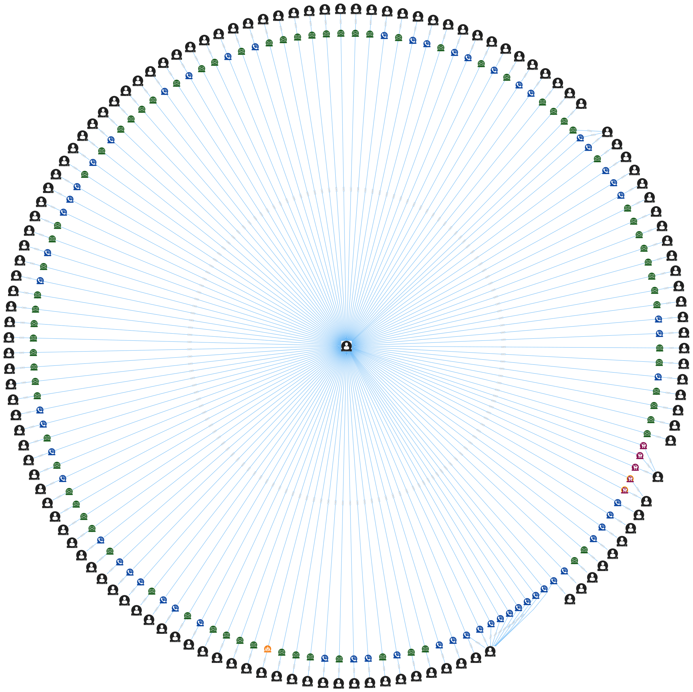

# VAST 2018: Mini-Challenge 3

## Question 1

To analyze the growth of the company, we first started with the analysis of how many people were active throughout the whole timeline inside the company. While tracking active employees, we also tracked how many employees left the company. We decided that an employees date of termination was the date of his last activity inside the company. To remove some noise from the visualizations, we are grouping the information in months.


As we can see here, there's a linear progression in the amount of active employees each month, giving the impression of growth. And we can see that there's very few employees that stop being active each month. To be able to better see this, we've plotted only the leaving users and capping the y-axis to 16000.


There's a strange decrease of active users in the last two months, but we attribute that to the fact that there's missing data at the end of the timeline.

However, when analyzing the activity inside the information, we get a very different picture:


Even though we have a linear increase in employees, we can see that throught out the period, there's almost a constant amount of purchases, calls and emails, having only the meetings increasing.

Therefore we could assume that the Company is growing in number of people but hasn't grown in the economical sense.

## Question 2

After loading all of the information on a graph database, we decided to tag all of the suspicious people named based from the _Insider Letter_ with a `Suspicious` label so as to differenciate them from the rest.

After tagging those people, we proceeded to see which people talked with at least two suspects:

```
MATCH (first:Suspect)<--(candidate:Person)-->(second:Suspect)
WHERE NOT (first) = (second)
RETURN *
```

With those relationships, we marked the suspects in red and applied a radial graph layout which resulted in the following pattern:


As we can see from the graph, there are two distinct communication partitions. The first partition (top) is composed completely of non-suspicious people and doesn't seem very interesting.
The second partition is the one that interests us the most, since there are 6 people that seem to fall inside the suspicious category.
First interesting person is _Timothy Gibson_. We can see that he has **a lot** of communication with the non-suspicious group and that he interacted with only two people from the suspicious group. Given his connection level to the top group, it would seem that he wasn't closely involved with the suspicious people.

Second interesting data from this graph is the purchase made by Rosalia to Jenice. Upon exploring Jenice Savaria, we can see that she has only interacted with Rosalia and a purchase was involved.

Third interesting group are the remaining 5: Martha Harris, Madeleine Nidorf, Sheilah Stachniw, Feme Hards and Sherrel Biebel.
Pruning the above graph, we get a more clear view of this group:


We can see that each of these 5 people are closely related with the suspicious group having interaction with around a quarter of them. This could be an indicator that these 5 people have to be closely observed since they are possible suspects.

Analysing each of these 25 suspects, we search the graph for any purchase that was done by them:

```
MATCH (s:Person)-[c:PURCHASES_FROM]->(p:Person)
WHERE
	(s.name = "Martha Harris"
     OR s.name = "Madeline Nidorf"
     OR s.name = "Sheilah Stachniw"
     OR s.name = "Feme Hards"
     OR s.name = "Sherrell Biebel")
    OR s.suspicious = true
RETURN s, p
```

We get the following:


Giving us 6 purchases which we need to review from the following people:

| From             | To             | When                 |
| ---------------- | -------------- | -------------------- |
| Rosalia Larroque | Jenice Savaria | 2017-09-20T03:38:53Z |
| Lizbeth Jindra   | Gail Feindt    | 2017-03-10T21:11:00Z |
| Sheilah Stachniw | Gail Feindt    | 2016-06-08T12:17:01Z |
| Tobi Gatlin      | Gail Feindt    | 2015-10-12T05:56:52Z |
| Meryl Pastuch    | Gail Feindt    | 2015-09-10T22:29:24Z |
| Richard Fox      | Gail Feindt    | 2015-05-25T15:17:41Z |

Reviewing the group's activity, we can see that it started forming around the 5th of November of 2015:

```
MATCH (s:Suspect)-[c]-(t:Suspect)
WHERE c.created_at < datetime('2015-11-05')
RETURN s, c, t
```


And fast-forwarding in time, we can see that by the 1st of June of 2016 the group was nearly fully formed:


And already contains the suspects, leaving us with the following suspicious purchases:

| From             | To             | When                 |
| ---------------- | -------------- | -------------------- |
| Rosalia Larroque | Jenice Savaria | 2017-09-20T03:38:53Z |
| Lizbeth Jindra   | Gail Feindt    | 2017-03-10T21:11:00Z |
| Sheilah Stachniw | Gail Feindt    | 2016-06-08T12:17:01Z |

## Question 3

In the beginning, there was _Richard Fox_ (2015/11/05):


After fast-forwarding 10 days, we can see that the group of suspicious people start branching out:


There are a couple of separate clusters which show that though these people are suspicious _today_, they were not connected to the main group at that date.
We can see also that _Richard Fox_ is a source of communication with various members of the group. No one still has communicated with him. Also, _Sherrell Bievel_ seems to be gaining importance between the group, since it appears as if many members start to communicate with her. One final interesting person in this cluster is _Madeline Nindorf_, since she is starting to look as a nexus between two clusters of suspicious people.

When we look at the first semester of 2016:


There's a detached group, but in the main group, we can see that the most popular person in this period was Lindsey Henion.

Looking at the period 2016/06/01 to 2016/12/31:


We can see that there are two groups that interact with each other and end up reporting to _Glen Grant_, which could indicate that he could be a decision maker inside this group.

During the first semester of 2017 nothing peculiar happened, but during the second semester, we get to the one and only suspicious purchase:


During this last semester, we get to the suspicious purchase reported by the insider. We see that _Sherrell Biebel_, _Meryl Pastuch_ and _Richard Fox_ met together a few days before the _Meryl Pastuch_-_Rosalia Larroque_ meeting, which in turn was a few days before the purchase. This could indicate that the brain behind the purchase was the person that started everything: _Richard Fox_.

## Question 4

In this last question we found changing our graph from just Nodes of People with relations to all Nodes would give us the extra information about how the graph works in time.

This is the result:


We did not find a similar pattern in the *OtherSuspect* purchases.

When finding the initial structure 
```
MATCH (s:Suspicious:Purchase)--(x:Person)--(e:Event)--(y:Person) RETURN *
```
This was the result


Performing the same in `OtherSuspicious` didn't work very well:


So we did a more manual check:

And then search only for Beth:

And Trevor:


In these circular vizualizations we can see they had several events in common with some of it's contacts, and based on the structure of the known suspicious it's likely they are part of the suspicious net.

One idea to tackle the massive amount of information issue is to prune *Popular* people and try to find relations without them, allowing us to perform more deep analisys into the relations.

## Resources

- [Neo4j graph database](https://neo4j.com/)
  - Explore node relationships and patterns from processed data
- [yWorks Neo4j explorer](https://www.yworks.com/neo4j-explorer/)
  - Node layout and analysis
- [PostgreSQL](https://www.postgresql.org/)
  - Agreggation and analysis of source data
- [Metabase](https://www.metabase.com/)
  - Data visualization
